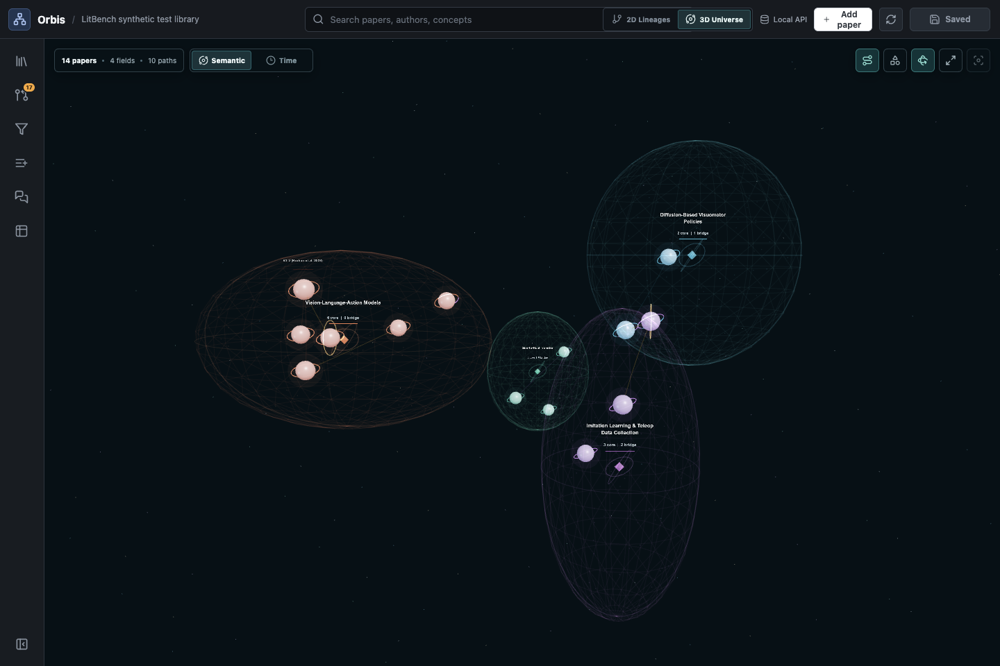
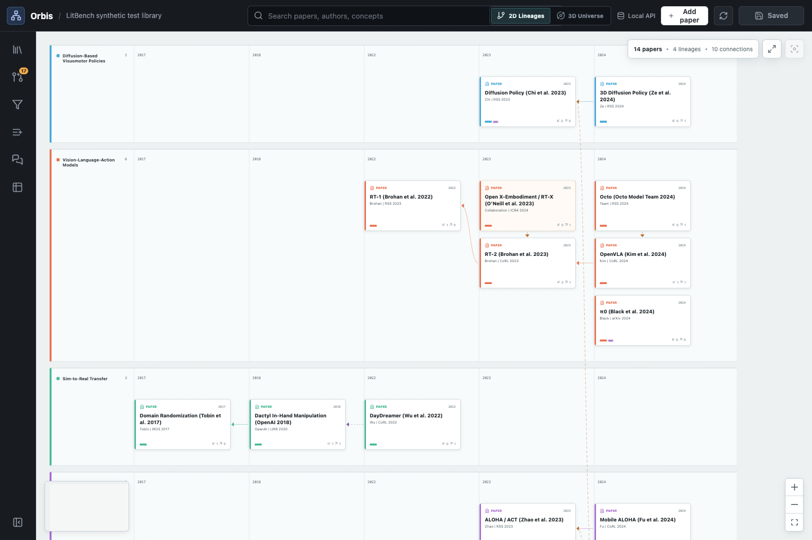
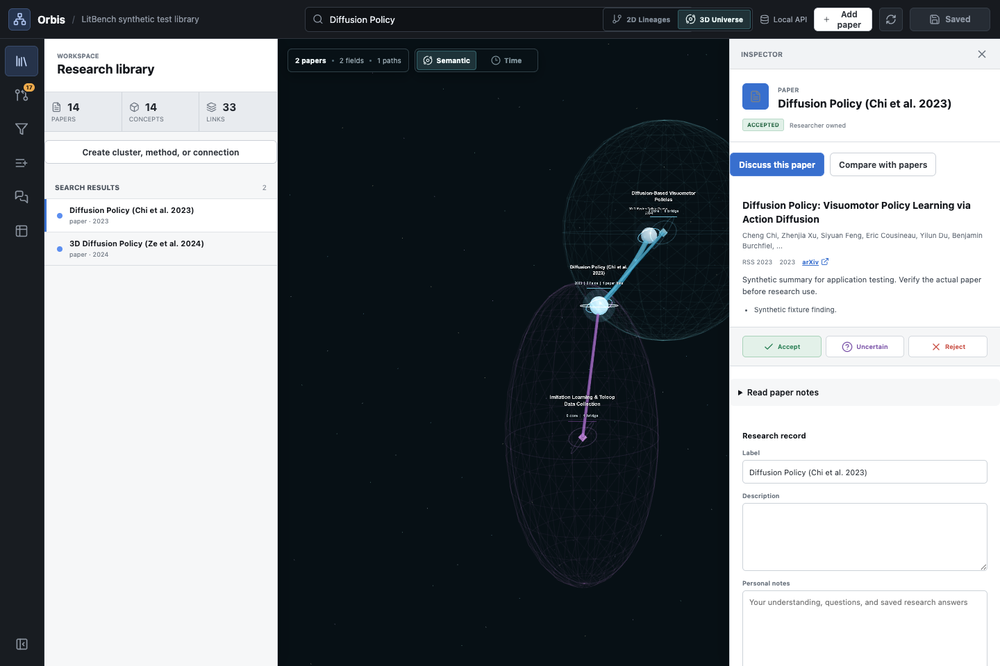

# Orbis

**Read papers. Connect ideas. Build your own research map.**

Orbis turns a paper library into an interactive workspace. See how papers
relate, keep the ideas you want to remember, and ask questions grounded in your
notes—all from a browser on your own computer.



## Get started

Download this repository using **Code → Download ZIP** and unzip it. Open a
terminal in the extracted folder and run:

```sh
sh start.sh
```

That's the setup command and the launch command. It installs uv if needed, lets
uv manage Python and its dependencies, sets up the frontend build tools, and
starts Orbis. You do not need to install Python, Node.js, or npm yourself.
First launch needs internet access and may take a few minutes; later launches
reuse the installed tools and built app. Supported on **macOS and Linux**.

When it's ready, the terminal prints something like:

```text
Orbis serving on http://127.0.0.1:8000  (Ctrl-C to stop)
```

**Open the address printed in your terminal.** It works on your computer while
Orbis is running; it is not a hosted demo website. If port 8000 is busy, the
launcher chooses another available port. Keep the terminal open while using the
app, and press `Ctrl+C` when you're done.

<details>
<summary>Prefer Git?</summary>

```sh
git clone https://github.com/Nike353/LitBench.git
cd LitBench
sh start.sh
```

To update later, stop the server, run `git pull --ff-only`, then run `sh start.sh`
again. Changed frontend source is rebuilt automatically.

</details>

### Add your first paper

Your library starts empty. Click **Add paper**, paste an arXiv URL, and choose
an agent. Orbis reads the paper and proposes a place for it in your graph,
along with methods and relationships. Review the proposals, accept what belongs,
and **Save changes**.

For importing papers and asking AI questions, install and sign in to **one** of
[Codex](https://developers.openai.com/codex/quickstart) or
[Claude Code](https://code.claude.com/docs/en/quickstart), then restart Orbis.
These features use that account's provider and usage limits. Browsing and manual
editing work without an agent.

## See the connections

Switch between the **3D Universe** for exploring research fields and
**2D Lineages** for following how papers build on one another. Search for a paper,
focus a field, or reveal the methods and concepts connecting the work.



## Make the library yours

Select a paper to read its summary, findings, original notes, and connections.
Add your own notes, organize papers into clusters, or create a relationship with
an explanation and supporting evidence.



## Ask, compare, and keep what you learn

| What you want to do                | Where to start                                                     |
| ---------------------------------- | ------------------------------------------------------------------ |
| Understand a paper                 | Select it and choose **Discuss this paper**.                       |
| Compare approaches                 | Open **Compare**, choose 2–20 papers, and pick your columns.       |
| Ask a specific comparison question | Add a custom column, such as “What changes at deployment?”         |
| Check an answer                    | Expand the cited sources or the evidence attached to a table cell. |
| Remember an insight                | Use **Save answer as note** to add it to a research record.        |
| Reorganize the graph               | Ask for a change, inspect the proposal, then accept or reject it.  |
| Take your work elsewhere           | Export comparisons as CSV and conversations as Markdown or JSON.   |

Try: “What changes between these two methods?” or “Explain this paper's main
limitation and propose a short note.” Conversations are saved locally so you can
come back later. Answers use the notes available in your library; missing details
should be identified rather than guessed. Review the evidence and proposed edits.

_The screenshots above use a small synthetic demo library. Your own installation
starts empty, and no personal research library is included in this repository._

## Where your work lives

Orbis was previously called LitBench; the repository URL and existing library
folder names retain that name for compatibility. The application and your library
are stored separately. By default, your papers,
notes, graph, and conversations live in:

- **macOS:** `~/Library/Application Support/LitBench/default`
- **Linux:** `~/.local/share/LitBench/default` (or under `XDG_DATA_HOME`)

To use a different library:

```sh
sh start.sh --workspace /path/to/my-library
```

To back up your work, stop Orbis and copy that entire library folder.
Application updates do not replace it. AI features send selected paper context
to your configured provider; see [data handling](SECURITY.md) for details.

## Need a hand?

- **Setup stopped?** Check your connection and run `sh start.sh` again. Downloads
  and environments are reused. Setup does not require sudo or edit shell profiles.
- **Agent not found?** Run `sh start.sh --doctor`, sign in to your agent CLI, and
  restart. Custom executable paths and more help are in the [user guide](docs/USER_GUIDE.md).
- **Want a specific port?** Use `sh start.sh --port 8100`.
- **No 3D support?** Use the graph fallback or the 2D lineage view.
- **Using Windows?** Native Windows is not supported yet; the launcher targets
  macOS and Linux.

## Contribute

Orbis uses React and TypeScript for the interface and Python for its local
server. Python setup is locked with uv; frontend dependencies are locked with npm.
The launcher installs a private Node runtime using the uv-managed `nodeenv` tool.

See [CONTRIBUTING.md](CONTRIBUTING.md) for development and tests, the
[user guide](docs/USER_GUIDE.md) for workflows, and the
[architecture notes](docs/ARCHITECTURE.md) for how the app fits together.

Released under the [MIT license](LICENSE).
